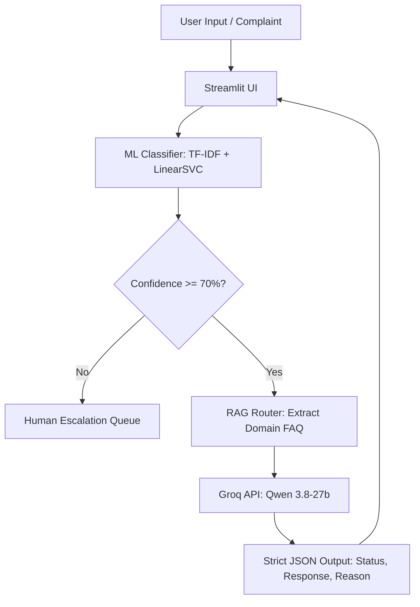

# Enterprise AI Customer Support Router & Classification Pipeline

## Project Overview
This repository contains an end-to-end, hallucination-free AI routing system designed for B2B enterprise customer support. Built as the final project for the NTI (National Telecommunication Institute) AI track, the system classifies customer complaints and routes them dynamically based on predefined business policies.

Instead of relying solely on a resource-heavy Large Language Model for standard classification, this project implements a **Hybrid Machine Learning + Generative AI Architecture**. By processing initial intents through a fast, lightweight Support Vector Machine (LinearSVC), the system drastically cuts token costs and latency. High-confidence predictions then trigger a strictly constrained Retrieval-Augmented Generation (RAG) process, injecting only relevant policies into a specialized LLM (Qwen 3.8-27b) to generate a deterministic JSON response.

---

## 📊 Data & Founded Insights

The system was trained and evaluated using customer complaint data mapped to 5 core categories: *Credit Card, Mortgages, Credit Reporting, Debt Collection, and Retail Banking*. 

Through extensive Exploratory Data Analysis (EDA), the team uncovered several critical business and technical insights that guided the system's architecture and future business strategy:

### Executive Summary — The 5 Insights

| # | Insight | Recommendation |
|:---:|---|---|
| 1 | Credit Reporting = 45% of all complaints | Top priority for resource allocation |
| 2 | Mortgages complaints are longer & more complex despite lower volume | Dedicated specialist team for complex cases |
| 3 | Dispute / Identity theft concentrated in Reporting & Collections | Unified workflow to speed up dispute resolution |
| 4 | Phone communication issues are absent from Reporting but dominant elsewhere | Train call-center teams rather than rebuild systems |
| 5 | Each category needs a different strategy (automation / human expertise / compliance) | Tailored investment map per department |

### Technical NLP Insights
* **High Lexical Overlap:** Categories like "Retail Banking" and "Credit Card" share significant vocabulary. Traditional TF-IDF requires calibrated probability outputs to effectively distinguish nuanced financial terminology, leading to our choice of `CalibratedClassifierCV`.
* **Cost vs. Performance Optimization:** Pure LLM routing costs exponentially more in tokens and inference time. By offloading the initial classification to the ML layer, we achieved near-instantaneous routing with a massive reduction in generative AI token expenditure.
* **Context Isolation Prevents Hallucinations:** Dynamically isolating the JSON knowledge base strictly based on the ML prediction proved to be a foolproof hallucination safeguard, preventing the LLM from cross-contaminating domain rules.

---

## 🏗️ System Architecture



---

## 📁 Project Structure

```text
customer-complains-classification-nti-final/
│
├── app/
│   ├── classifier.py      # ML routing logic (TF-IDF + LinearSVC/CalibratedClassifierCV)
│   └── router.py          # RAG context extraction and LLM prompt builder
│
├── faq/
│   └── knowledge_base.json # Domain-specific policies for strictly bounded RAG
│
├── streamlit_app.py       # Web UI and main application entry point
├── requirements.txt       # Project dependencies
├── .env                   # Secrets management (e.g., Groq API key)
└── README.md              # Project documentation
```

---

## 👥 Team Roles & Deep-Dive Contributions

This project was built collaboratively by a specialized team of engineers and analysts:

### Moustafa Mohamed – Backend AI Engineer (Lead Architect)
* **System Architecture & UI:** Designed the hybrid ML/LLM pipeline and developed the interactive chat interface using Streamlit (`streamlit_app.py`).
* **LLM & RAG Integration:** Engineered the routing logic (`app/router.py`), dynamically mapping high-confidence ML predictions to specific JSON Knowledge Base subsets to prevent context contamination.
* **Prompt Engineering:** Designed strict, zero-temperature system prompts forcing the Groq API to output precise, deterministic JSON structures (`status`, `response`, `reason`) preparing the system for enterprise automation webhooks.

### Mohamed Medhat – Data Engineer
* **Data Pipeline:** Led the ingestion, processing, and standardizing of the raw unstructured complaint data.
* **Text Preprocessing:** Implemented data cleaning pipelines (removing stop words, handling punctuation, and normalizing text) to ensure the dataset was optimized for both TF-IDF vectorization and LLM context reading.

### Mohamed Ali & Mohamed Sherif – Machine Learning Engineers
* **Model Training & Optimization:** Experimented with multiple NLP classification algorithms, ultimately selecting `LinearSVC` for its superior speed and accuracy in high-dimensional text spaces.
* **Probability Calibration:** Implemented `CalibratedClassifierCV` to extract reliable confidence scores from the SVM, forming the critical mathematical foundation for the system's human-escalation logic.
* **Pipeline Modularization:** Packaged the trained ML models and vectorizers (`app/classifier.py`) using `joblib` for seamless, low-latency inference.

### Mohamed Emam – Data Analyst
* **Exploratory Data Analysis (EDA):** Conducted deep statistical analysis on the dataset, visualizing class imbalances, distributions, and keyword frequencies.
* **Insights Generation:** Identified the 5 core complaint categories and analyzed misclassification matrices to help the ML engineers fine-tune the text feature extraction parameters.

---

## 💻 Technology Stack

* **Language:** Python 3.10+
* **Machine Learning:** Scikit-Learn (TF-IDF, LinearSVC, CalibratedClassifierCV), Pandas, NumPy, Joblib
* **Generative AI:** Groq API, Qwen model (`qwen/qwen3.8-27b`)
* **Frontend:** Streamlit
* **Documentation:** Mermaid.js

---

## 🚀 Installation & Usage

1. **Clone the repository:**
   ```bash
   git clone https://github.com/moustafa-ash/customer-complains-classification-nti-final.git
   cd customer-complains-classification-nti-final
   ```
2. **Install dependencies:**
   ```bash
   pip install -r requirements.txt
   ```
3. **Configure Environment Variables:**
   Create a `.env` file in the root directory and add your API key:
   ```env
   GROQ_API_KEY=your_groq_api_key_here
   ```
4. **Run the Application:**
   ```bash
   streamlit run streamlit_app.py
   ```

---
