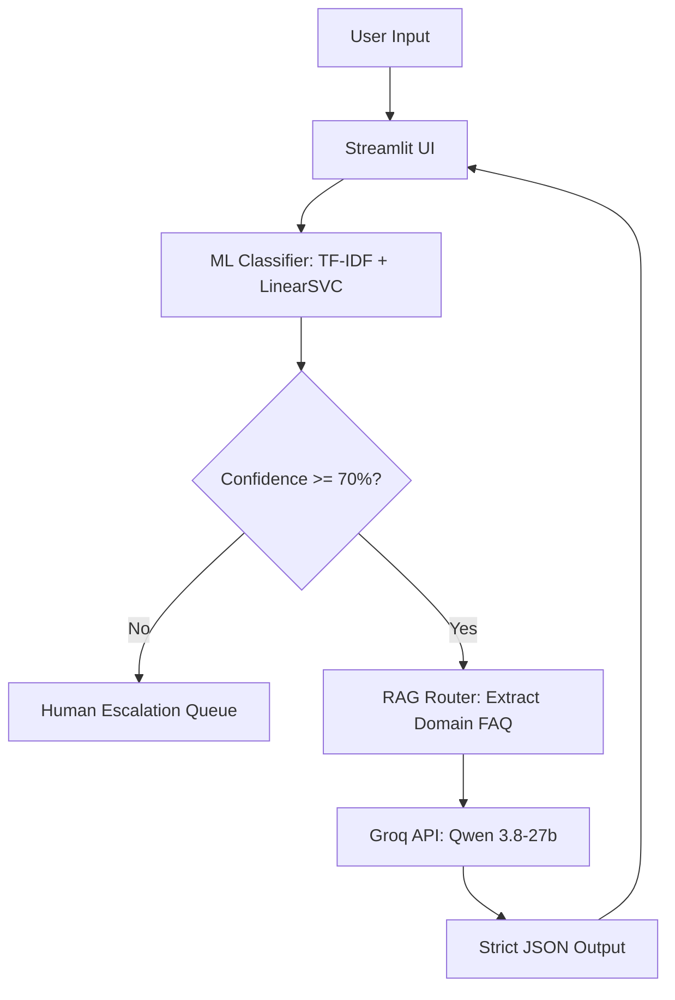

# AI Customer Support Routing System

An end-to-end, hallucination-free hybrid AI routing pipeline built for enterprise B2B customer support. This system solves three critical bottlenecks in generative AI automation: high token costs, latency, and model hallucinations.

By combining lightweight Machine Learning for intent classification with a strictly constrained Large Language Model (LLM) for policy generation, the system provides instantaneous routing and deterministic JSON outputs ready for downstream automation (e.g., n8n, Zapier).

## System Architecture

The pipeline utilizes a hybrid approach to isolate enterprise policies and prevent cross-contamination of contexts.



## Key Features

* **Hybrid ML + Generative AI:** Uses Scikit-Learn (LinearSVC) for fast, low-cost intent multi-class classification, saving LLM API tokens for complex generation tasks.
* **Threshold Guardrails:** Predictions below 70% confidence automatically bypass the LLM and route to a human agent, preventing unauthorized guesswork.
* **Strict Context Isolation:** High-confidence intents trigger a dynamic RAG pipeline that injects *only* the specific domain policy into the LLM prompt.
* **Deterministic JSON Output:** The Groq API is forced to return strict JSON (`status`, `response`, `reason`), allowing seamless webhook integration with external platforms.

## Installation & Setup

1. **Clone the repository:**

   ```bash
   git clone https://github.com/yourusername/ai-customer-support-router.git
   cd ai-customer-support-router
   ```

2. **Install dependencies:**

   ```bash
   pip install -r requirements.txt
   ```

3. **Configure Environment Variables:**
   Create a `.env` file in the root directory and add your Groq API key:

   ```env
   GROQ_API_KEY=your_api_key_here
   ```

4. **Run the Application:**

   ```bash
   streamlit run streamlit_app.py
   ```

## Project Team & Roadmap

**Development Team:**

* **Moustafa Mohamed** – Backend AI Engineer (Architecture, UI, LLM/RAG, Prompting)
* **Mohamed Medhat** – Data Engineering
* **Mohamed Ali & Mohamed Sherif** – ML Engineering
* **Mohamed Emam** – Data Analysis
